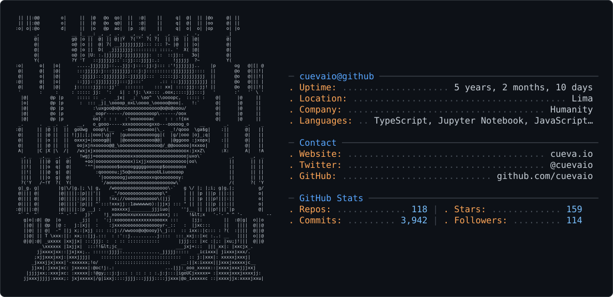

<picture>
  <source media="(prefers-color-scheme: dark)" srcset="dark_mode.svg" />
  <source media="(prefers-color-scheme: light)" srcset="light_mode.svg" />
  
</picture>

### Hello there!

I'm Anthony, a software engineer from Lima, Perú 🇵🇪

I build products... and make sure they reach people.

Through code, content, and community.

I’ve spent the last years deep in the technical side: building systems that deal with real-time sync, performance under load, and increasingly, AI agents, memory, and orchestration.

These days, I’m focused on turning that technical depth into products people actually use.

Currently building [Normal](https://github.com/cuevaio/normal), the WhatsApp automation platform.

Co-founder of [Crafter Station 💛](https://crafterstation.com/), a LatAm community spreading shipping culture through hackathons, Code Brews, live demos, and builder-first events.

Other things I’ve built:

* [Local Background Remover](https://local.backgroundrm.com/) — remove image backgrounds locally, pay once
* [OpenCoder](https://opencoder.cueva.io/) — run opencode in the cloud
* [text0](https://text0.dev/) — Cursor for writers, Vercel Hackathon winner
* [Lupa 🔍](https://lupa.build/) — Knowledge Platform for AI Agents

You should also meet [Railly](https://github.com/railly/), [Cris](https://github.com/camilocbarrera), and [Nico](https://github.com/MrUprizing).

> [!note]
> Visit my site [cueva.io](https://www.cueva.io)
